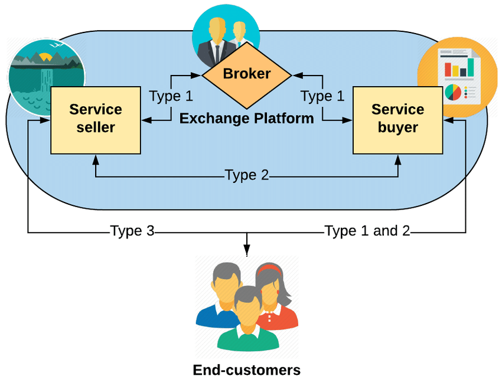

<a name="readme-top"></a>


<div align="center">
  
  <br/>

  <h3><b>Yuunga Back-End</b></h3>

</div>

<!-- TABLE OF CONTENTS -->

# 📗 Table of Contents

- [📗 Table of Contents](#-table-of-contents)
- [📖 Yuunga Backend ](#-yuunga-backend-)
  - [🛠 Built With ](#-built-with-)
    - [Tech Stack ](#tech-stack-)
    - [Key Features ](#key-features-)
  - [Yuunga Front-End](#yuunga-front-end)
  - [💻 Getting Started ](#-getting-started-)
    - [Prerequisites](#prerequisites)
    - [Setup](#setup)
    - [Install](#install)
    - [Usage](#usage)
    - [Run tests](#run-tests)
    - [Deployment](#deployment)
  - [👥 Authors ](#-authors-)
  - [🤝 Contributing ](#-contributing-)
  - [⭐️ Show your support ](#️-show-your-support-)
  - [🙏 Acknowledgments ](#-acknowledgments-)
  - [📝 License ](#-license-)

<!-- PROJECT DESCRIPTION -->

# 📖 Yuunga Backend <a name="about-project"></a>


**Yuunga Backend** is a back-end implementation of the Yuunga app. It exposes API endpoints to a React FrontEnd to perform operations on the Apps Postgres Database. Yuunga is a B2B platform that connects small businesses to their customers. It allows small businesses to create a profile and list their products and services. Customers can then search for businesses and products and services they offer. Customers can also leave reviews for businesses they have interacted with. Businesses can connect and interact with each other through the platform creating a consumption and supply network.

## 🛠 Built With <a name="built-with"></a>
- Rails
- Ruby
- Rspec
- RSwagger - Open API

### Tech Stack <a name="tech-stack"></a>


<details>
  <summary>Client</summary>
  <ul>
    <li><a href="https://reactjs.org/">React.js</a></li>
  </ul>
</details>

<details>
  <summary>Server</summary>
  <ul>
    <li><a href="https://rubyonrails.org/">Ruby on Rails</a></li>
  </ul>
</details>

<details>
<summary>Database</summary>
  <ul>
    <li><a href="https://www.postgresql.org/">PostgreSQL</a></li>
  </ul>
</details>

<!-- Features -->

### Key Features <a name="key-features"></a>


- **Business create profiles**
- **Businesses list their products and consumables.**
- **Customers search for business and products**
- **Location based search**
- **B2B network**

<p align="right">(<a href="#readme-top">back to top</a>)</p>

<!-- LIVE DEMO -->

## Yuunga Front-End

[Front End App](https://github.com/JonahKayizzi/Yunga-React-Rails-Front-End.git)

<p align="right">(<a href="#readme-top">back to top</a>)</p>

<!-- GETTING STARTED -->

## 💻 Getting Started <a name="getting-started"></a>


To get a local copy up and running, follow these steps.

### Prerequisites

In order to run this project you need:


```sh
 gem install rails
 bundle install
 rails db:create
 rails db:migrate
 rails db:seed
```


### Setup

Clone this repository to your desired folder:


```sh
  cd my-folder
  git clone https://github.com/JonahKayizzi/Yunga-React-Rails-BackEnd.git
```


### Install

Install this project with:


```sh
  cd Yuunga-Backend
  gem install
  bundle install
```


### Usage

To run the project, execute the following command:


```sh
  rails server or rails s
```


### Run tests

To run tests, run the following command:


```sh
  rspec ./spec/models
  rspec ./spec/integration
```


### Deployment

You can deploy this project using:


```sh
  bin/dev
```


<p align="right">(<a href="#readme-top">back to top</a>)</p>


## 👥 Authors <a name="authors"></a>

👤 **Jonathan Kayizzi**

- GitHub: [@JonahKayizzi](https://github.com/JonahKayizzi)
- Twitter: [@JonahKayizzi](https://twitter.com/JonahKayizzi)
- LinkedIn: [LinkedIn](https://www.linkedin.com/in/jonathan-kayizzi/)

<p align="right">(<a href="#readme-top">back to top</a>)</p>


<!-- CONTRIBUTING -->

## 🤝 Contributing <a name="contributing"></a>

Contributions, issues, and feature requests are welcome!

Feel free to check the [issues page](https://github.com/JonahKayizzi/Yunga-React-Rails-BackEnd/issues).

<p align="right">(<a href="#readme-top">back to top</a>)</p>

<!-- SUPPORT -->

## ⭐️ Show your support <a name="support"></a>


If you like this project you can give me a ⭐️

<p align="right">(<a href="#readme-top">back to top</a>)</p>

<!-- ACKNOWLEDGEMENTS -->

## 🙏 Acknowledgments <a name="acknowledgements"></a>


<p align="right">(<a href="#readme-top">back to top</a>)</p>


<!-- LICENSE -->

## 📝 License <a name="license"></a>

<p align="right">(<a href="#readme-top">back to top</a>)</p>
